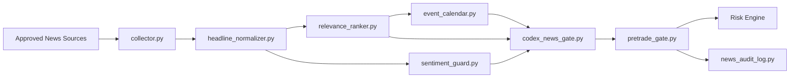

# News And Context Gate

## Purpose

The news gate is a bounded pre-trade filter. It does not place trades, modify risk rules, or bypass execution controls. Its output is advisory to the deterministic risk engine.

## Responsibilities

- ingest recent headlines from approved sources
- normalize records into a stable internal structure
- rank relevance by symbol, asset class, and macro theme
- identify event windows from the configured calendar
- detect stale-only context
- detect conflicting headline sets
- emit a bounded gate decision for pre-trade filtering
- write append-only audit records

## Decision Contract

The bounded output contains:

- `symbol`
- `timestamp`
- `decision_gate`
- `impact_level`
- `reasons`
- `source_count`
- `valid_for_minutes`
- `confidence_info`

Allowed `decision_gate` values:

- `ALLOW`
- `BLOCK`
- `REDUCE_RISK`
- `REVIEW`

Mapped runtime behavior:

- `ALLOW` -> no gate restriction
- `BLOCK` -> no new entries
- `REDUCE_RISK` -> reduced-risk mode may apply
- `REVIEW` -> no automatic new entry until the higher-level policy allows it

## Flow

## Module Responsibilities

| Module | Responsibility |
| --- | --- |
| `src/news/collector.py` | Reads recent items from approved in-memory, file, or HTTP JSON sources |
| `src/news/headline_normalizer.py` | Normalizes raw feed items into structured headline records |
| `src/news/event_calendar.py` | Detects whether the current time falls inside configured event windows |
| `src/news/relevance_ranker.py` | Scores symbol relevance using aliases, asset classes, and macro themes |
| `src/news/sentiment_guard.py` | Marks stale sets and conflicting headline clusters |
| `src/news/codex_news_gate.py` | Produces a bounded context assessment for logging and filtering |
| `src/decision/pretrade_gate.py` | Combines collector, ranking, calendar, and guard results into one gate output |
| `src/monitoring/news_audit_log.py` | Writes append-only news gate evaluations and daily summaries |

## Decision Hierarchy

The gate resolves context in this order:

1. Confirm the symbol is known or degrade safely for unknown relevance.
2. Load headlines inside the configured lookback window.
3. Remove stale items for active decisioning while retaining them for audit.
4. Rank relevance for the target symbol.
5. Evaluate configured event windows.
6. Evaluate conflicting headline clusters.
7. Choose the most conservative bounded output among event, conflict, freshness, and empty-news logic.

## Default Decision Rules

| Condition | Gate Result |
| --- | --- |
| No relevant or no recent news | `ALLOW` with short validity |
| Only stale relevant headlines | `REVIEW` |
| Conflicting fresh headline set | `REVIEW` |
| Active high-impact event window | `BLOCK` |
| Active medium-impact window | `REDUCE_RISK` |
| Fresh relevant non-conflicting headlines without event block | `ALLOW` or `REDUCE_RISK` depending on impact |

## Operational Modes

| Mode | Expected Use |
| --- | --- |
| `demo` | Synthetic or static news fixtures for end-to-end validation |
| `paper` | Approved live news sources without live broker execution |
| `backtest` | Optional replayed headlines or empty-news fallback |
| `live` | Approved recent headlines and event windows before new entries |

The module behaves the same way across modes. Only the source adapters differ.

## Configuration Overview

The gate is driven by `config/news.yaml`.

The runtime coordinator uses the gate's configured collector-backed provider path. In practice, live and paper runs read the `news.sources` entries, collect recent headlines from those approved adapters, derive the effective context timestamp from the freshest collected item, and then apply the bounded gate before risk evaluation.

Key configuration groups:

- `approved_sources`
- `sources`
- `collector.lookback_minutes`
- `collector.per_source_limit`
- `staleness.headline_stale_after_minutes`
- `validity.*`
- `relevance.minimum_score`
- `symbol_aliases`
- `asset_class_by_symbol`
- `macro_theme_keywords`
- `macro_themes_by_symbol`
- `calendar.events`

## Incident Handling

Use the conservative response below:

- source unavailable: continue with remaining approved sources and audit reduced source count
- malformed headline item: skip the record and audit the parse failure
- stale-only context: return `REVIEW`
- unknown symbol: default to low-confidence `ALLOW` or `REVIEW` depending on configured policy surface
- conflicting high-relevance set: return `REVIEW`
- calendar parse failure: block startup through config validation rather than running with ambiguous event timing

## Audit Trail

Each evaluation is written to:

- `logs/<mode>/news_gate_audit.jsonl`

Daily summaries are written to:

- `logs/<mode>/daily_summaries/news-audit-summary-YYYY-MM-DD.json`
- `logs/<mode>/daily_summaries/news-audit-summary-YYYY-MM-DD.txt`

Records include:

- gate decision
- impact level
- reasons
- source counts
- freshness and conflict metadata
- correlation context when available

## Safety Notes

- The news gate never widens risk limits.
- Directional interpretation is bounded and non-executing.
- Empty or malformed context does not grant additional trading authority.
- The execution layer still performs independent timestamp, health, and duplicate checks.
